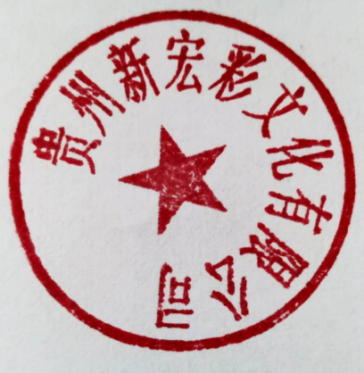

# 印章提取

#### Python

python version 2.x

#### Install

```bash
$ pip install opencv-python
$ pip install numpy
$ sudo pip install Pillow
```

#### Run

```bash
$ python getseal.py -i source.png -o out.png
```

#### Result




#### Quote

- https://blog.csdn.net/wsp_1138886114/article/details/82858380